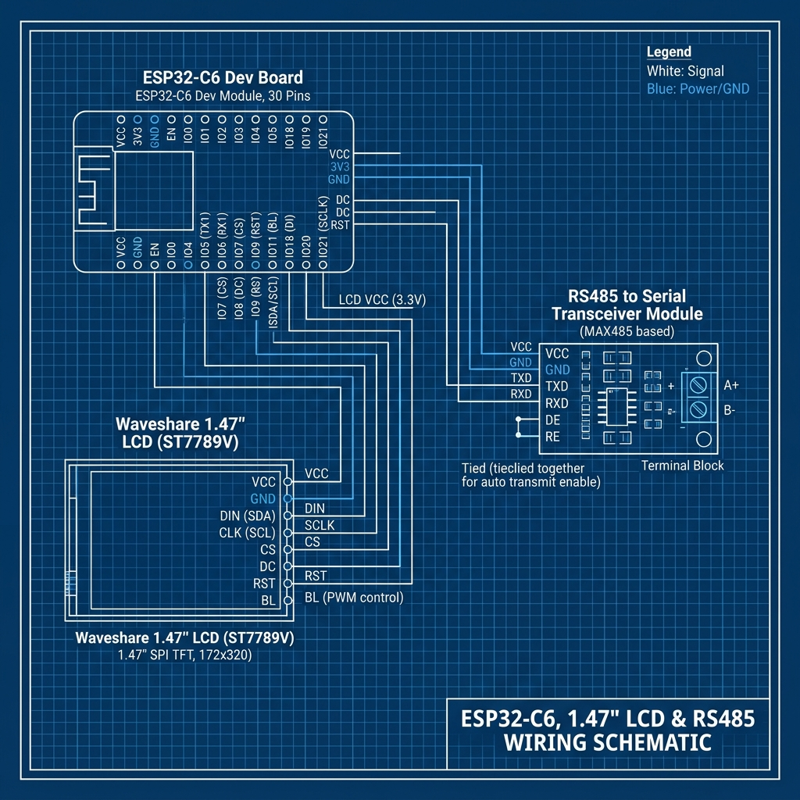

# Документация конфигурации `esp32-c6-pv19-display.yaml`

Данный файл содержит описание специализированной конфигурации ESPHome для платы **ESP32-C6-DevKitC-1**, используемой для мониторинга солнечного гибридного инвертора **Must PH19** по протоколу Modbus (RS485) с выводом информации на локальный дисплей, индикацией статуса на встроенном светодиоде и управлением подсветкой.

---

## 🛠️ Аппаратное обеспечение и распиновка (Pinout)

В конфигурации используются следующие выводы платы ESP32-C6:

| Компонент | Пин | Описание |
| :--- | :--- | :--- |
| **UART TX** | `GPIO16` | Отправка данных Modbus (RS485) |
| **UART RX** | `GPIO17` | Прием данных Modbus (RS485) |
| **SPI CLK** | `GPIO7` | Тактовая частота шины SPI дисплея |
| **SPI MOSI**| `GPIO6` | Передача данных шины SPI дисплея |
| **Display CS**| `GPIO14` | Chip Select дисплея ST7789V |
| **Display DC**| `GPIO15` | Data/Command дисплея ST7789V |
| **Display RST**| `GPIO21` | Сброс (Reset) дисплея |
| **Backlight** | `GPIO22` | Подсветка дисплея (ШИМ-управление) |
| **Onboard LED**| `GPIO8` | Встроенный адресный светодиод WS2812 |

### Схема подключения



### Схема подключения (Mermaid Diagram)

```mermaid
graph TD
    subgraph "ESP32-C6 DevKitC-1"
        3V3["3.3V"]
        GND1["GND"]
        G16["GPIO16 (TX)"]
        G17["GPIO17 (RX)"]
        G6["GPIO6 (MOSI)"]
        G7["GPIO7 (SCLK)"]
        G14["GPIO14 (CS)"]
        G15["GPIO15 (DC)"]
        G21["GPIO21 (RST)"]
        G22["GPIO22 (BL)"]
    end

    subgraph "Waveshare 1.47\" LCD (ST7789V)"
        LCD_VCC["VCC"]
        LCD_GND["GND"]
        LCD_DIN["DIN"]
        LCD_CLK["CLK"]
        LCD_CS["CS"]
        LCD_DC["DC"]
        LCD_RST["RST"]
        LCD_BL["BL"]
    end

    subgraph "RS485 to UART Module"
        RS_VCC["VCC"]
        RS_GND["GND"]
        RS_RXD["RXD"]
        RS_TXD["TXD"]
        RS_A["A / TR+"]
        RS_B["B / TR-"]
    end

    subgraph "MUST Inverter RS485 Port"
        INV_A["PIN 1 / A"]
        INV_B["PIN 2 / B"]
        INV_GND["PIN 8 / GND"]
    end

    %% LCD Connections
    3V3 --> LCD_VCC
    GND1 --> LCD_GND
    G6 --> LCD_DIN
    G7 --> LCD_CLK
    G14 --> LCD_CS
    G15 --> LCD_DC
    G21 --> LCD_RST
    G22 --> LCD_BL

    %% RS485 Connections
    3V3 --> RS_VCC
    GND1 --> RS_GND
    G16 --> RS_RXD
    G17 --> RS_TXD

    %% Modbus to Inverter
    RS_A --- INV_A
    RS_B --- INV_B
    GND1 --- INV_GND
```

---

## 🌟 Ключевые отличия от оригинального репозитория

Наш конфигурационный файл [esp32-c6-pv19-display.yaml](esp32-c6-pv19-display.yaml) содержит следующие доработки и оптимизации по сравнению со стандартным шаблоном:

### 1. Поддержка ESP32-C6 и ESP-IDF
* Конфигурация адаптирована под чип ESP32-C6 с использованием современного фреймворка **ESP-IDF**, что обеспечивает лучшую энергоэффективность, работу с современными стандартами Wi-Fi 6 и стабильность шины SPI.

### 2. Фиксированный IP-адрес (Static IP)
* Для предотвращения потери связи и обеспечения мгновенного подключения настроен статический IP-адрес:
  * **IP**: `192.168.1.33`
  * **Маска подсети**: `255.255.255.0`
  * **Шлюз**: `192.168.1.1`

### 3. Информативный дисплей (Waveshare 1.47" 172x320)
Конфигурация выводит ключевые параметры системы в реальном времени:
* **Заголовок**: Текущее имя устройства (`Must Inverter: MUST_PH19`).
* **Wi-Fi**: Уровень сигнала (RSSI) в верхнем правом углу.
* **IP-адрес**: Отображается в левом нижнем углу для быстрого доступа к веб-интерфейсу.
* **SOC (Уровень заряда батареи)**: Расположен по центру крупным шрифтом с цветовой индикацией состояния (Зеленый $\ge 50\%$, Желтый $20-49\%$, Красный $< 20\%$).
* **Мощность**: Отображает текущую суммарную генерацию от солнечных панелей (`PV Power`) и потребляемую нагрузку (`Load Power`).
* **Статус**: Код текущего рабочего режима инвертора.
* **Батарея**: Текущее напряжение аккумулятора в вольтах.

### 4. Плавная регулировка подсветки с памятью
* Подсветка экрана (`GPIO22`) переведена с обычного переключателя (Вкл/Выкл) на **ШИМ-управление (LEDC)**.
* В Home Assistant она отображается как диммируемый источник света (Light).
* Благодаря параметру `restore_mode: RESTORE_DEFAULT_ON`, ESPHome **запоминает последнюю установленную яркость** подсветки и восстанавливает её при перезапуске платы.

### 5. Индикация заряда на Onboard RGB LED
* Встроенный адресный светодиод платы (`GPIO8`, WS2812) привязан к уровню заряда батареи (`soc`) через триггер `on_value` и меняет цвета аналогично индикатору на дисплее:
  * **Зелёный** цвет: Заряд $\ge 50\%$ (аккумулятор достаточно заряжен).
  * **Жёлтый** цвет: Заряд от $20\%$ до $49\%$ (средний уровень).
  * **Красный** цвет: Заряд $< 20\%$ (низкий уровень заряда).

---

## 🚀 Как собрать и прошить

1. Убедитесь, что ваши пароли Wi-Fi и API-ключи заполнены в файле `secrets.yaml`.
2. Скомпилируйте прошивку с помощью ESPHome CLI:
   ```bash
   esphome compile esp32-c6-pv19-display.yaml
   ```
3. Для первой прошивки или восстановления после сбоя сети подключите плату по USB и воспользуйтесь сайтом [ESPHome Web Tools](https://web.esphome.io/), выбрав скомпилированный файл по пути:
   `.esphome/build/must-ph19/.pioenvs/must-ph19/firmware.factory.bin`
