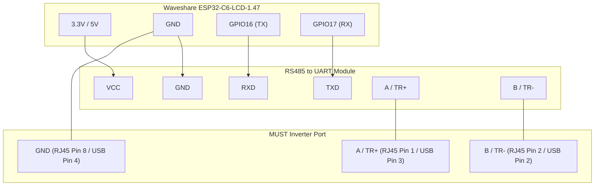

# Документация конфигурации `esp32-c6-pv19-display.yaml`

Данный файл содержит описание специализированной конфигурации ESPHome для платы со встроенным дисплеем **[Waveshare ESP32-C6-LCD-1.47](https://docs.waveshare.com/ESP32-C6-LCD-1.47)**, используемой для мониторинга солнечного гибридного инвертора **Must PH19** по протоколу Modbus (RS485) с выводом информации на локальный дисплей, индикацией статуса на встроенном светодиоде и управлением подсветкой.

> [!NOTE]
> В самом конфигурационном файле ESPHome в качестве базовой платы указана `esp32-c6-devkitc-1`, так как это стандартный базовый профиль микроконтроллера ESP32-C6 в PlatformIO, полностью совместимый с платой от Waveshare.

---

## 🛠️ Схема внешнего подключения (RS485 / Modbus)

Поскольку дисплей и светодиод уже распаяны на самой плате Waveshare ESP32-C6-LCD-1.47, пользователю требуется подключить только внешний модуль **RS485 to UART** для связи с инвертором.

### Распиновка подключения конвертера к плате:

| Вывод платы Waveshare | Пин конвертера RS485 | Описание |
| :--- | :--- | :--- |
| **3.3V** / **5V** | **VCC** | Питание конвертера |
| **GND** | **GND** | Общая земля |
| **GPIO16 (TX)** | **RXD** | Передача данных Modbus |
| **GPIO17 (RX)** | **TXD** | Прием данных Modbus |

### Подключение конвертера к инвертору MUST:

Вы можете подключить конвертер RS485 к инвертору одним из двух способов в зависимости от модели инвертора:

#### Вариант А: Через порт RJ45 (RS485 / CAN)

| Пин конвертера RS485 | Пин порта RJ45 инвертора | Описание |
| :--- | :--- | :--- |
| **A / TR+** | **PIN 1** / A | Сигнальная линия A |
| **B / TR-** | **PIN 2** / B | Сигнальная линия B |
| **GND** | **PIN 8** | Земля RS485 |

#### Вариант Б: Через порт Wi-Fi (разъем USB Type-A)

> [!WARNING]
> Этот разъем на инверторе **не является стандартным USB-портом**. В нем нет USB-данных, но присутствуют линии питания +5В и шина RS485. Не подключайте к нему обычные USB-устройства!

Для подключения используйте обычный кабель USB Type-A, обрезав один конец для распайки к RS485 конвертеру:

| Пин кабеля USB Type-A | Пин конвертера RS485 | Описание |
| :--- | :--- | :--- |
| **Pin 1 (VCC)** | **5V / VCC** на плате ESP | Питание +5В от инвертора (опционально) |
| **Pin 2 (D-)** | **B / TR-** | Линия RS485-B |
| **Pin 3 (D+)** | **A / TR+** | Линия RS485-A |
| **Pin 4 (GND)** | **GND** | Общая земля |

### Схема подключения (Mermaid Diagram)



---

## 🌟 Ключевые отличия от оригинального репозитория

Наш конфигурационный файл [esp32-c6-pv19-display.yaml](esp32-c6-pv19-display.yaml) содержит следующие доработки и оптимизации по сравнению со стандартным шаблоном:

### 1. Поддержка ESP32-C6 и ESP-IDF
* Конфигурация адаптирована под чип ESP32-C6 с использованием современного фреймворка **ESP-IDF**, что обеспечивает лучшую энергоэффективность, работу с современными стандартами Wi-Fi 6 и стабильность шины SPI.

### 2. Фиксированный IP-адрес (Static IP)
* Для предотвращения потери связи и обеспечения мгновенного подключения настроен статический IP-адрес:
  * **IP**: `192.168.1.33`
  * **Маска подсети**: `255.255.255.0`
  * **Шлюз**: `192.168.1.1`

### 3. Информативный дисплей (Waveshare 1.47" 172x320)
Конфигурация выводит ключевые параметры системы в реальном времени:
* **Заголовок**: Текущее имя устройства (`Must Inverter: MUST_PH19`).
* **Wi-Fi**: Уровень сигнала (RSSI) в верхнем правом углу.
* **IP-адрес**: Отображается в левом нижнем углу для быстрого доступа к веб-интерфейсу.
* **SOC (Уровень заряда батареи)**: Расположен по центру крупным шрифтом с цветовой индикацией состояния (Зеленый $\ge 50\%$, Желтый $20-49\%$, Красный $< 20\%$).
* **Мощность**: Отображает текущую суммарную генерацию от солнечных панелей (`PV Power`) и потребляемую нагрузку (`Load Power`).
* **Статус**: Код текущего рабочего режима инвертора.
* **Батарея**: Текущее напряжение аккумулятора в вольтах.

### 4. Плавная регулировка подсветки с памятью
* Подсветка экрана (`GPIO22`) переведена с обычного переключателя (Вкл/Выкл) на **ШИМ-управление (LEDC)**.
* В Home Assistant она отображается как диммируемый источник света (Light).
* Благодаря параметру `restore_mode: RESTORE_DEFAULT_ON`, ESPHome **запоминает последнюю установленную яркость** подсветки и восстанавливает её при перезапуске платы.

### 5. Индикация заряда на Onboard RGB LED
* Встроенный адресный светодиод платы (`GPIO8`, WS2812) привязан к уровню заряда батареи (`soc`) через триггер `on_value` и меняет цвета аналогично индикатору на дисплее:
  * **Зелёный** цвет: Заряд $\ge 50\%$ (аккумулятор достаточно заряжен).
  * **Жёлтый** цвет: Заряд от $20\%$ до $49\%$ (средний уровень).
  * **Красный** цвет: Заряд $< 20\%$ (низкий уровень заряда).

---

## 🚀 Как собрать и прошить

1. Убедитесь, что ваши пароли Wi-Fi и API-ключи заполнены в файле `secrets.yaml`.
2. Скомпилируйте прошивку с помощью ESPHome CLI:
   ```bash
   esphome compile esp32-c6-pv19-display.yaml
   ```
3. Для первой прошивки или восстановления после сбоя сети подключите плату по USB и воспользуйтесь сайтом [ESPHome Web Tools](https://web.esphome.io/), выбрав скомпилированный файл по пути:
   `.esphome/build/must-ph19/.pioenvs/must-ph19/firmware.factory.bin`
