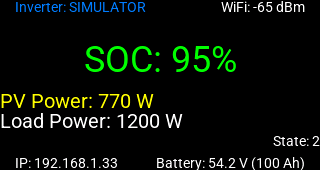
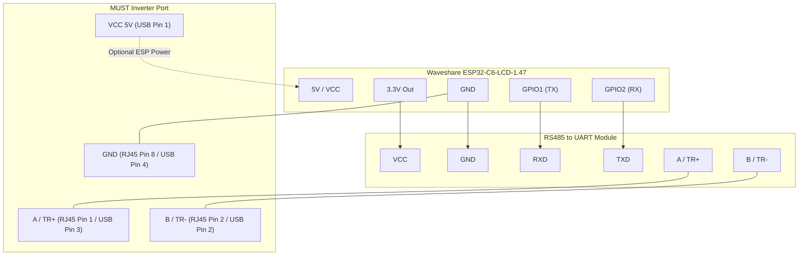

# Configuration Documentation for `esp32-c6-pv19-display.yaml`

This file provides a detailed description of the specialized ESPHome configuration for the **[Waveshare ESP32-C6-LCD-1.47](https://docs.waveshare.com/ESP32-C6-LCD-1.47)** board, used to monitor **Must PH19/PV19** solar hybrid inverters via the Modbus (RS485) protocol.



---

## External Connection Diagram (RS485 / Modbus)

Since the display and LED are already integrated into the Waveshare ESP32-C6-LCD-1.47 board, you only need to connect an external **RS485 to UART** module to communicate with the inverter.

### Converter to Waveshare Board Pinout:

| Waveshare Board Pin | RS485 Converter Pin | Description |
| :--- | :--- | :--- |
| **3.3V** / **5V** | **VCC** | Converter power supply |
| **GND** | **GND** | Common ground (mandatory!) |
| **IO1 (GPIO1/TX)** | **RXD** | Modbus Data Transmission |
| **IO2 (GPIO2/RX)** | **TXD** | Modbus Data Reception |

> [!IMPORTANT]
> On this board, pins GPIO16/17 and GPIO12/13 are not suitable for Modbus due to internal hardware conflicts. Use only **IO1** and **IO2**.

### Connecting the Converter to the MUST Inverter:

You can connect the RS485 converter to the inverter in one of two ways, depending on your inverter model:

#### Option A: Via RJ45 Port (RS485 / CAN)

| RS485 Converter Pin | Inverter RJ45 Port Pin | Description |
| :--- | :--- | :--- |
| **A / TR+** | **PIN 1** / A | Signal Line A |
| **B / TR-** | **PIN 2** / B | Signal Line B |
| **GND** | **PIN 8** | RS485 Ground |

#### Option B: Via Wi-Fi Port (USB Type-A Connector)

> [!WARNING]
> This connector on the inverter is **not a standard USB port**. It does not provide USB data but carries +5V power lines and the RS485 bus. Do not connect standard USB devices to it!

To connect, use a regular USB Type-A cable, cutting one end to solder to the RS485 converter:

| USB Type-A Cable Pin | RS485 Converter Pin | Description |
| :--- | :--- | :--- |
| **Pin 1 (VCC)** | **5V / VCC** on ESP board | +5V power from inverter (optional) |
| **Pin 2 (D-)** | **B / TR-** | RS485-B Line |
| **Pin 3 (D+)** | **A / TR+** | RS485-A Line |
| **Pin 4 (GND)** | **GND** | Common Ground |

### Connection Diagram (Mermaid Diagram)



---

## Key Differences from the Original Repository

This configuration is a deep overhaul of the base project. Main improvements include:

### 1. Modern Hardware Support (ESP32-C6)
* **ESP-IDF Framework:** Unlike the original (Arduino), this version uses the professional ESP-IDF framework, ensuring stable UART operation and Wi-Fi 6 support.
* **Modbus Optimization:** Increased receive buffer (`rx_buffer_size: 1024`) and tuned delays (`command_throttle`, `send_wait_time`) specifically adapted for MUST inverters.

### 2. Local Monitoring (LCD Display)
* **ST7789 Interface:** Real-time data output directly to the board's screen. You don't need to open Home Assistant to see key parameters:
    * **SOC** (Battery Charge) in large font with color-coded status.
    * Total solar panel output (**PV Power**).
    * Household load (**Load Power**).
    * Battery voltage and inverter work state.

### 3. Intelligent Indication (Smart LED)
* **Addressable LED:** The built-in WS2812 now acts as a system health indicator.
* **SOC Logic:** The LED changes color (Green/Yellow/Red) based on the battery charge level, with logic protected against invalid values (`nan`) during communication glitches.

### 4. Enhanced Reliability and Comfort
* **Static IP:** Configured with a static IP address to prevent connection loss.
* **PWM Backlight:** Screen brightness is smoothly adjustable via Home Assistant and saved after a reboot.
* **Stability Tweaks:** Fine-tuned Modbus controller settings to minimize CRC errors in the EMI-heavy environment of the inverter.

---

## How to Build and Flash

1. Ensure your Wi-Fi passwords and API keys are filled in the `secrets.yaml` file.
2. Compile the firmware using the ESPHome CLI:
   ```bash
   esphome compile esp32-c6-pv19-display.yaml
   ```
3. For the initial flash or recovery after a network failure, connect the board via USB and use [ESPHome Web Tools](https://web.io/), selecting the compiled file located at:
   `.esphome/build/must-ph19/.pioenvs/must-ph19/firmware.factory.bin`
